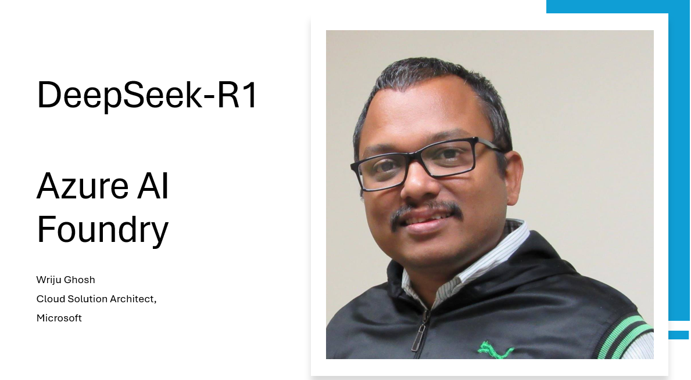

# Developing Application using DeepSeek-R1 with Azure AI Foundry

### DeepSeek-R1 based application written in Python for demo

Link to video https://youtu.be/nrWCj_-iq-8

### 9 part Azure Open AI Application Development Series
https://www.youtube.com/watch?v=9bbNbukPT2Y&list=PLPIVZsyfpXt8oifc9GOnWS2AsOvllIEwK

### GitHub Repo
https://github.com/wrijugh/deepseek-application

